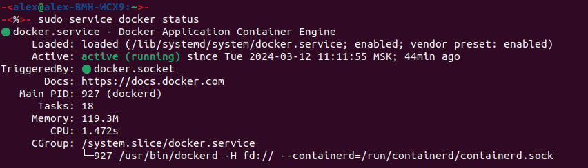
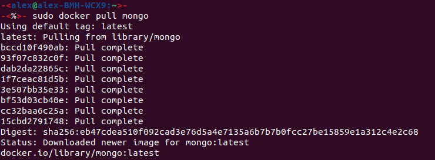
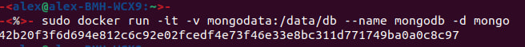
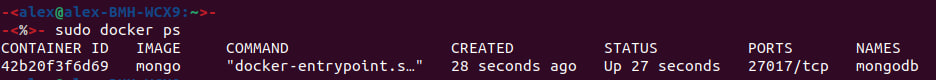

# Creating container

We will follow instructions from [here](https://phoenixnap.com/kb/docker-mongodb).

1. Firstly, check is the docker daemon is running:
    ```shell
    sudo service docker status
    ```
    If the docker daemon isn't running, we can turn it on:
    ```shell
    sudo systemctl start docker
    ```
   
2. Now one should download MongoDB latest official image to start docker container:
   ```shell
   sudo docker pull mongo
   ```
   
3. We need to change a directory, in which MongoDB stores 
data so that it won't be erased if a container instance fails. 

   a. Make a new directory in the host system:
   ```shell
   sudo mkdir -p /mongodata
   ```
   
   b. Start MongoDB replacing its data directory on the created one:
   ```shell
   sudo docker run -it -v mongodata:/data/db --name mongodb -d mongo
   ```
   
   
   c. If a docker container already exists:
   ```shell
   docker container rm <container_id>
   ```
4. Now let's make sure the docker container with MongoDB is running. 
For that we'll see the list of all running containers:
   ```shell
   sudo docker ps
   ```
   
5. Finally, open a bash terminal inside our docker container:
   ```shell
   sudo docker exec -it mongodb bash
   ```
   
[Next part](working_with_MongoDB.md)