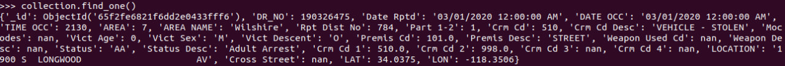
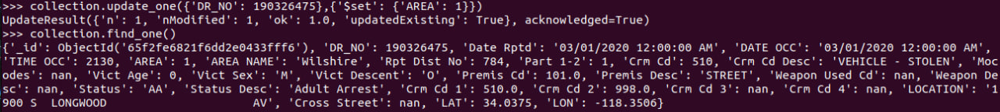

# Working with MongoDB

For work with MongoDB in container I will use [PyMongo](https://www.mongodb.com/docs/drivers/pymongo/).
The documentation is [here](https://pymongo.readthedocs.io/en/stable/).
To install `PyMongo` of the latest version one needs to install following packages:
```shell
apt update
apt install -y python3-pip
pip install pymongo
```
See the `PyMongo` version:

### Creating database

All the following actions will be held in python.

**CREATE**

Create a database:

```python
from pymongo import MongoClient


client = MongoClient()         # Create a client connectinf on the default host and port
new_db = client.test_database  # Make a new database
```

### Fill database with data
> I'm the king of the world!    
> © Jack Dawson, Titanic

For filling the database I will use [Titanic dataset](https://web.stanford.edu/class/archive/cs/cs109/cs109.1166/problem12.html).

To get a collection:

  ```python
  collection = new_db.test_collection
  collection.insert_many(passengers)  # Passengers - json with passenger data
  ```

To see the database table names:
```python
new_db.list_collection_names()
```


**READ** 
* To see the names of columns in a collection:
  ```python
  collection.find_one().keys()
  ```
  
* To see first row:
  ```python
  collection.find_one()
  ```
  

**UPDATE**

Now, as we can see, Mr. Braund didn't manage to survive. Let's revive him:
```python
collection.update_one({'Name': 'Mr. Owen Harris Braund'},{'$set': {'Survived': 1}})
```


**DELETE**

To delete the information from a table one can use:
```python
collection.delete_one({'Name': 'Mr. Owen Harris Braund'})
```


**COUNT**

Let's see, how many females died:
```python
collection.count_documents({'Sex': 'female', 'Survived': 0})
```


**INDEXES**

To compare the time I'll run this code:
```python
from time import time

collection.drop_indexes()
start_time = time()
print(collection.count_documents({'Sex': 'female', 'Survived': 0}))
finish_time = time()
print(f"Time spent: {finish_time - start_time}")

collection.create_index(keys='Name', name='new_index', unique=True)
start_time = time()
print(collection.count_documents({'Sex': 'female', 'Survived': 0}))
finish_time = time()
print(f"Time spent: {finish_time - start_time}")
```


As we can see, the time it takes to make a select, increases. 
The reason for this is that the dataset contains few rows, 
so adding the index doesn't improve the performance.

[Next part](stopping_container.md)
