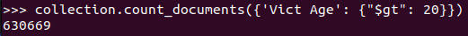
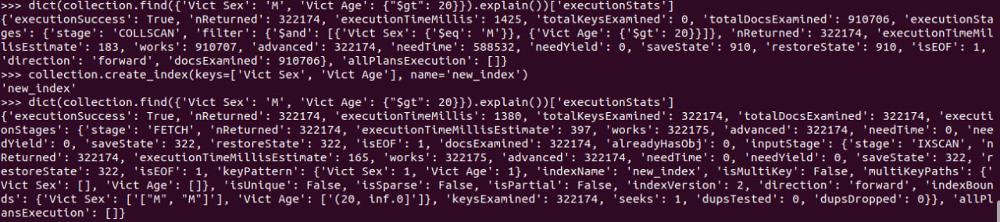

# Working with MongoDB

For work with MongoDB in container I will use [PyMongo](https://www.mongodb.com/docs/drivers/pymongo/).
The documentation is [here](https://pymongo.readthedocs.io/en/stable/).
To install `PyMongo` of the latest version one needs to install following packages:
```shell
apt update
apt install -y python3-pip
pip install pymongo
pip install pandas
```
See the `PyMongo` version:


### Creating database

All the following actions will be held in python.

**CREATE**

Create a database:

```python
from pymongo import MongoClient


client = MongoClient()         # Create a client connectinf on the default host and port
new_db = client.test_database  # Make a new database
```

### Fill database with data

For filling the database I will use [Crimes dataset](https://catalog.data.gov/dataset/crime-data-from-2020-to-present).

Upload data from host to container:
```shell
docker cp ./dataset/crime_data.csv <container_id>:/crime_data.csv
```


To get a collection and insert data:

```python
import pandas as pd


collection = new_db.test_collection
data = pd.read_csv('/crime_data.csv')
collection.insert_many(data.to_dict('records'))
```

To see the database table names:
```python
new_db.list_collection_names()
```


**READ** 
* To see the names of columns in a collection:
  ```python
  collection.find_one().keys()
  ```
  
* To see first row:
  ```python
  collection.find_one()
  ```
  

**UPDATE**

Let's change number of area in the first row with `DR_NO = 190326475`
```python
collection.update_one({'DR_NO': 190326475},{'$set': {'AREA': 1}})
```


**DELETE**

To delete the information from a table one can use:
```python
collection.delete_one({'DR_NO': 190326475})
```


**COUNT**

Let's see, how many victims over 20 is in dataset:
```python
collection.count_documents({'Vict Age': {"$gt": 20}})
```


**INDEXES**

Add indexes:
```python
collection.create_index(keys=['Vict Sex', 'Vict Age'], name='new_index')
```

Drop indexes:
```python
collection.drop_indexes()
```

To compare the time we can see query execution stats:
```python
dict(collection.find({'Vict Sex': 'M', 'Vict Age': {"$gt": 20}}).explain())['executionStats']
```



As we can see from `executionTimeMillis`, adding index helps to slightly improve performance.

**DROP**

Drop database:

```python
client.drop_database('test_database')
```
[Next part](stopping_container.md)