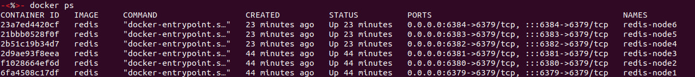
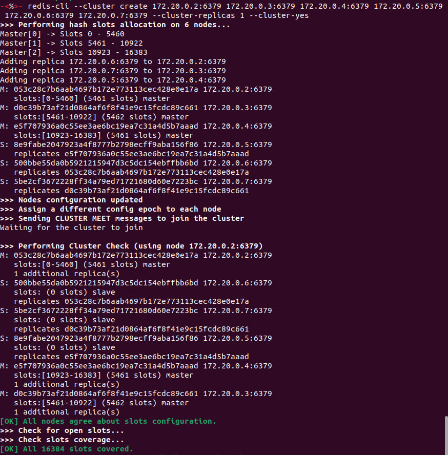
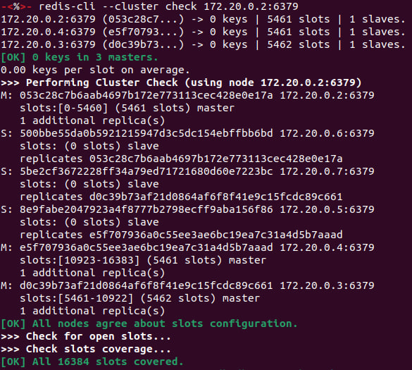
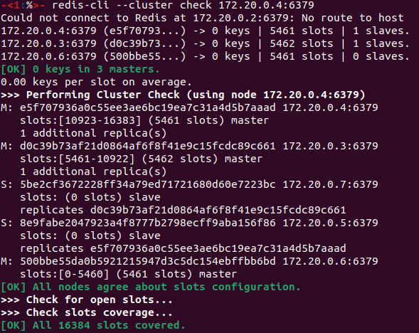

# Cluster
Firstly, we need to install redis on local machine:
```shell
sudo apt install redis
```
Secondly, we need to pull latest version of image for redis:
```shell
docker pull redis
```
To create a redis cluster, we will create a docker network:
```shell
docker network create redis-net
```
Let's create files with nodes' configurations. (For convenience I will create a special folder for every node).
Now we'll take a closer look at one of them: [redis.conf](6379/redis.conf)

Here we have:
* `port` - number of port redis is listening
* `cluster-enabled` - enables redis cluster support
* `cluster-config-file` - specifies file in which redis will save cluster configuration
* `cluster-node-timeout` - time to wait for connection to other nodes of cluster
* `appendoly` - redis will write logs and after restart it will append new lines, but not rewrite the file 
* `timeout` - time, within which the client must send request. Otherwise, server will close connection 

Now we need to start 6 containers (as redis requires at least 6 nodes) with configuration from redis-nodeN.conf files. 
We also should specify the ports:
```shell
docker run -v `pwd`/6379:/redis --name redis-node1 --network redis-net -p 6379:6379 -d redis redis-server /redis/redis.conf
docker run -v `pwd`/6380:/redis --name redis-node2 --network redis-net -p 6380:6379 -d redis redis-server /redis/redis.conf
docker run -v `pwd`/6381:/redis --name redis-node3 --network redis-net -p 6381:6379 -d redis redis-server /redis/redis.conf
docker run -v `pwd`/6382:/redis --name redis-node4 --network redis-net -p 6382:6379 -d redis redis-server /redis/redis.conf
docker run -v `pwd`/6383:/redis --name redis-node5 --network redis-net -p 6383:6379 -d redis redis-server /redis/redis.conf
docker run -v `pwd`/6384:/redis --name redis-node6 --network redis-net -p 6384:6379 -d redis redis-server /redis/redis.conf
```

* Here we create a folder for volume inside containers and put `./num_port/redis.conf` file here.
* The names of the nodes are redis-nodeN, where N is the number of node.
* We create nodes inside previously created docker network `redis-net`. 
* We also specify the ports, from 6379 to 6384 on local machine, 6379 (standard one) in containers.
* Then we build containers from image `redis` and specify path to `redis.conf` file.



Now we need to create a cluster. First we need to get IPs of our nodes:
```shell
docker ps 
docker inspect <container_id> | grep IPAddress
```
| Node | IP         |
|------|------------|
| 1    | 172.20.0.2 |
| 2    | 172.20.0.3 |
| 3    | 172.20.0.4 |
| 4    | 172.20.0.5 |
| 5    | 172.20.0.6 |
| 6    | 172.20.0.7 |

```shell
redis-cli --cluster create 172.20.0.2:6379 172.20.0.3:6379 172.20.0.4:6379 172.20.0.5:6379 172.20.0.6:6379 172.20.0.7:6379 --cluster-replicas```
```



> Note that ip-addresses may change after restarting containers.

Check if everything is ok:
```shell
redis-cli --cluster check <container_ip:port>
```



If we stop and remove one of master nodes, its replica will replace it:



**Conclusion**: As we have a replica of every master node, our cluster is fault-tolerant. 
Also with configuration we've made in case of misconfigurations on client's side 
(if client connects, but does not send any requests) server will still be effective
and will disconnect all the inactive clients.

To turn everything off we must stop containers and then remove them:
```shell
docker stop <container_name>
docker container rm <container_id>
```
Also don't forget to remove docker network:
```shell
docker network rm <network_name>
```

[Contents](README.md)