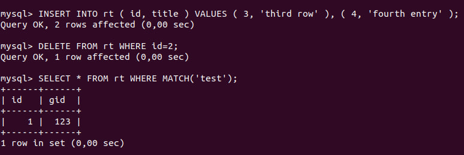

# Indexing

Official [documentation](http://sphinxsearch.com/docs/current/indexes.html).

## Overview

To be able to answer full-text search queries fast, Sphinx needs to build
a special data structure optimized for such queries from your text data. 
This structure is called *index*; and the process of building index from 
text is called *indexing*.

Sphinx provides 2 different backends (or index types): a **disk index** backend,
and a **realtime index** backend.
* **Disk indexes** are designed to provide maximum indexing and searching speed,
while keeping the RAM footprint as low as possible. But you can not update an 
existing document or incrementally add a new document to a disk index. You only
can batch rebuild the entire disk index from scratch. (Note that you still 
can update document's attributes on the fly, even with the disk indexes).
To avoid rebuilding indexes you can set up multiple disk indexes.
* **Realtime indexes** enable you to implement dynamic updates and incremental
additions to the full text index. They give you the opportunity to insert, 
update, or delete documents (rows) on the fly.
* Sphinx also supports **distributed indexes**. Those are not a real physical
backend, but rather just lists of either local or remote indexes that can be 
searched transparently to the application, with Sphinx doing all the chores of
sending search requests to remote machines in the cluster, aggregating the 
result sets, retrying the failed requests, and even doing some load balancing.

There can be as many indexes per configuration file as necessary.

## Example

Let's give an example of how to make an index. For this example I will build a
realtime index.

### Configuration

Now we need a main index and a rt index:
```
index rt
{
    type = rt
    path = /usr/local/sphinx/data/rt
    rt_field = title
    rt_field = content
    rt_attr_uint = gid
}

searchd
{
  listen            = 9306:mysql41
  log               = /var/log/sphinxsearch/searchd.log
  query_log         = /var/log/sphinxsearch/query.log
  read_timeout      = 5
  max_children      = 30
  pid_file          = /var/run/sphinxsearch/searchd.pid
  seamless_rotate   = 1
  preopen_indexes   = 1
  unlink_old        = 1
  binlog_path       = /var/lib/sphinxsearch/data
}
```

Note: indexer works only with indexes with source, not with rt indexes.

Now it's time to launch the search daemon by executing:
```shell
/usr/bin/searchd
```


Note: Maybe you will need to change `/var/lib/sphinxsearch/data/binlog.lock`, 
`/var/run/sphinxsearch/searchd.pid` and `/var/lib/sphinxsearch/data/rt.lock` 
privileges.

Entering `MySQL` console:
```shell
mysql -h0 -P9306
```

Let's execute some `INSERT` queries:
```mysql
INSERT INTO rt VALUES 
  (1, 'first record', 'test one', 123),
  (2, 'second record', 'test two', 234);

SELECT * FROM rt;

SELECT * FROM rt WHERE MATCH('test');

SELECT * FROM rt WHERE MATCH('@title test');
```


Now, let's execute some `DELETE` queries:
```mysql
INSERT INTO rt ( id, title ) VALUES ( 3, 'third row' ), ( 4, 'fourth entry' );

DELETE FROM rt WHERE id=2;

SELECT * FROM rt WHERE MATCH('test');
```



Finally, some `REPLACE` queries. If we try to insert in table a record with
id, which is already present in th table, we'll get an error:
```mysql
INSERT INTO rt VALUES ( 1, 'first record on steroids', 'test one', 123 );
```


Bur instead of `INSERT` we can use `REPLACE`, and rt index will let us do 
that:
```mysql
REPLACE INTO rt VALUES ( 1, 'first record on steroids', 'test one', 123 );

SELECT * FROM rt WHERE MATCH('steroids');
```


[Previous page](../distributed/distributed.md) | [Contents](../README.md) | [Next page](../query_exec/query_exec.md)