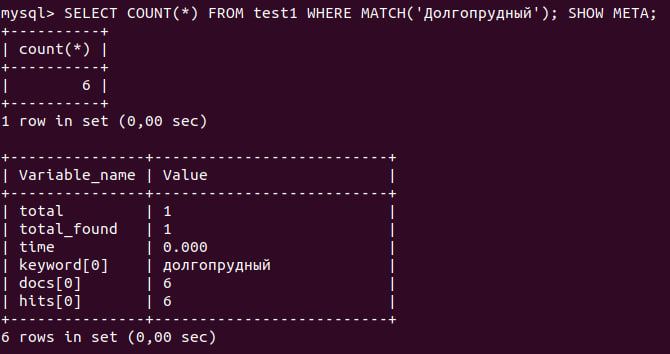

# Sphinx query language

## Overview

Sphinx text query syntax builds upon three major cornerstones:
* Keywords
* Operators
* Modifiers

*Keywords* are just the words you search for, which are treated as atoms, the most 
basic query building blocks. *Operators* combine keywords in different ways 
transforming them into *expressions*. *Modifiers* are attached to keywords, and
affect the way keywords match.

[Here](https://www.oreilly.com/library/view/introduction-to-search/9780596809546/ch04.html)
you can find all Sphinx operators.

Two principal stages of text searching are to specify what text to match, 
and then to put the result set of matches into the desired shape, which 
includes filtering, grouping, and ordering.

Sphinx's output is called the *result set*, and it comes in two parts: *matched 
documents* (a.k.a. row data) and *metadata*. Matched documents are indeed just 
rows from the Sphinx database. These results always include the document ID
and weight, and might also include additional attributes stored in the index
and expressions computed on the fly. Metadata provides a few interesting extra 
things about the result set in general the number of total matches, 
per-keyword frequency statistics, and so on. When you send a query to Sphinx 
using a programming API, the result combines row data and metadata into a 
single structure.

## Installation

[Official guide](https://sphinxsearch.com/docs/current/installing-debian.html).

Ubuntu only: 
```shell
sudo add-apt-repository ppa:builds/sphinxsearch-rel22   # Add Sphinxsearch repository
sudo apt-get update
sudo apt-get install sphinxsearch  # Install/update sphinxsearch package
```

Now we can start *searchd* daemon:
```shell
sudo service sphinxsearch start
```

Daemon can be stopped by executing:
```shell
sudo service sphinxsearch stop
```

## MySQL server

[Guide](https://www.linode.com/docs/guides/installing-and-configuring-mysql-on-ubuntu-2004/).

### Installation and server creation
Install MySQL:
```shell
sudo apt install mysql-server
sudo systemctl status mysql
```


To enter `MySQL` console type `sudo mysql`.
We can create user like that:
```sql
CREATE USER 'admin'@'localhost' IDENTIFIED WITH caching_sha2_password BY 'password';
```

We can also use default root user. To exit the MySQL type `exit`.

### Creating table

[Guide](https://medium.com/trinitytuts/configure-sphinx-full-text-search-engine-d6a3e2c8158f).

I'll use one of tables from my MIPT db project [repository](https://github.com/AliakseiSuvorau/MedcineDataBase).
Here are queries to create a database in MySQL:
```mysql
DROP DATABASE IF EXISTS `sphinx_demo`;
CREATE DATABASE `sphinx_demo`;
USE `sphinx_demo`;

CREATE TABLE `pharmacy` (
	`pharmacyno`    INT UNSIGNED NOT NULL,
	`address`       VARCHAR(200) NOT NULL,
	`website`       VARCHAR(100) NOT NULL,
	`workdayfromtm` TIME,
	`workdaytilltm` TIME,
	`holidayfromtm` TIME,
	`holidaytilltm` TIME
) ENGINE=InnoDB ROW_FORMAT=DYNAMIC;

INSERT INTO `pharmacy` (`pharmacyno`, `address`, `website`, `workdayfromtm`, `workdaytilltm`, `holidayfromtm`, `holidaytilltm`) VALUES
	(1, 'г. Москва, Мещанская ул., 14, стр. 1', 'planetazdorovo.ru', '08:00', '22:00', '08:00', '22:00'),
	(2, 'г. Москва, Щепкина ул., 5, стр. 1', 'eapteka.ru', '00:00', '23:59', '00:00', '23:59'),
	(3, 'г. Москва, просп. Мира, 38', 'gorzdrav.org', '07:00', '22:00', '09:00', '22:00'),
	(4, 'г. Москва, Щепкина ул., 33', 'rigla.ru', '08:00', '22:00', '08:00', '22:00'),
	(5, 'г. Москва, Щепкина ул., 35', '366.ru', '08:00', '21:00', '08:00', '21:00'),
	(6, 'г. Москва, Верхняя Красносельская ул., 24', 'gorzdrav.org', '08:00', '22:00', '09:00', '21:00'),
	(7, 'г. Москва, Краснопрудная ул., 13А', 'vitaexpress.ru', '08:00', '22:00', '08:00', '22:00'),
	(8, 'г. Москва, Нижняя Красносельская ул., 45/17', 'budzdorov.ru', '08:00', '22:00', '09:00', '21:00'),
	(9, 'г. Москва, Переведеновский пер., 8', 'eapteka.ru', '09:00', '20:00', '09:00', '20:00'),
	(10, 'г. Москва, Колодезный пер., 3', 'gz.ru', '08:00', '22:00', '09:00', '22:00'),
	(11, 'г. Москва, Колодезный пер., 3, стр. 26', 'samson-pharma.ru', '08:00', '22:00', '09:00', '21:00'),
	(12, 'г. Москва, Измайловское ш., 71А', '366.ru', '10:00', '22:00', '10:00', '22:00'),
	(13, 'г. Москва, 9-я Парковая ул., 32', 'gz.ru', '08:00', '22:00', '09:00', '21:00'),
	(14, 'г. Балашиха, микрорайон Дзержинского, 31', 'gz.ru', '08:00', '22:00', '09:00', '22:00'),
	(15, 'г. Долгопрудный, Первомайская ул., 3А', 'budzdorov.ru', '10:00', '22:00', '10:00', '22:00'),
	(16, 'г. Долгопрудный, Первомайская ул., 50', 'planetazdorovo.ru', '00:00', '23:59', '00:00', '23:59'),
	(17, 'г. Долгопрудный, Новый бул., 3', 'gz.ru', '09:00', '22:00', '09:00', '21:00'),
	(18, 'г. Долгопрудный, Новый бул., 7/1', 'planetazdorovo.ru', '00:00', '23:59', '00:00', '23:59'),
	(19, 'г. Долгопрудный, Лихачёвское ш., 6, корп. 4', '366.ru', '09:00', '22:00', '09:00', '22:00'),
	(20, 'г. Долгопрудный, Лихачёвское ш., 14, корп. 1', 'gz.ru', '09:00', '22:00', '09:00', '22:00');

ALTER TABLE `pharmacy`
  ADD PRIMARY KEY (`pharmacyno`);

ALTER TABLE `pharmacy`
  MODIFY `pharmacyno` INT(20) NOT NULL AUTO_INCREMENT, AUTO_INCREMENT=21;
```

Now we can execute `SHOW DATABASES;` to see is our newly created database `sphinx_demo` is here:


## Sphinx

### Configuration

[Guide](https://trinitytuts.com/setup-and-configure-sphinx-search-engine/).

We need to create (or update, if it exists) a configuration file `sphinx.conf` in `sudo nano /etc/sphinxsearch/sphinx.conf`:
```
source src1
{
    type            = mysql
    sql_host        = localhost
    sql_user        = root
    sql_pass        = ****
    sql_db          = sphinx_demo
    sql_port        = 3306  # MySQL port (default is 3306)

    sql_query       = SELECT pharmacyno, address, website, workdayfromtm,\
                             workdaytilltm, holidayfromtm, holidaytilltm \
                      FROM pharmacy
    
    sql_field_string =   address
    sql_field_string =   website
    sql_attr_timestamp = workdayfromtm
    sql_attr_timestamp = workdaytilltm
    sql_attr_timestamp = holidayfromtm
    sql_attr_timestamp = holidaytilltm
}

index test1
{
  source            = src1
  path              = /var/lib/sphinxsearch/data/test1
  docinfo           = extern
}

searchd
{
  listen            = 9306:mysql41
  log               = /var/log/sphinxsearch/searchd.log
  query_log         = /var/log/sphinxsearch/query.log
  read_timeout      = 5
  max_children      = 30
  pid_file          = /var/run/sphinxsearch/searchd.pid
  seamless_rotate   = 1
  preopen_indexes   = 1
  unlink_old        = 1
  binlog_path       = /var/lib/sphinxsearch/data
}
```

**Description**:
* **Source** block in configuration file contains information of data source 
like your MySql Server details. 
  * `type`: Type of data source to index. Other supported types include pgsql, mssql,
  xmlpipe2, odbc, and more.
  * `sql_host`: Hostname for the MySQL host. This can be a domain or IP address.
  * `sql_user`: Username for the MySQL login.
  * `sql_pass`: Password for the MySQL user.
  * `sql_db`: Name of the database that stores data.
  * `sql_query`x`: The query thats dumps data from the database to the index.
* The **index** component contains the source and the path to store the data.
  * `source`: Name of the source block.
  * `path`: The path to save the index.
* The **searchd** component contains the port and other variables to run the Sphinx 
daemon.
  * `listen`: The port which the Sphinx daemon will run.
  * `query_log`: The path to save the query log.
  * `pid_file`: The path to PID file of Sphinx daemon.
  * `seamless_rotate`: Prevents searchd stalls while rotating indexes with 
  huge amounts of data to precache.
  * `preopen_indexes`: Whether to forcibly preopen all indexes on startup.
  * `unlink_old`: Whether to delete old index copies on successful rotation.


[Here](https://pushorigin.ru/sphinx/attrs) we can find all Sphinx attributes.

**Note**: The first column in the result of the query is always taken as the id,
so we do not need to specify `pharmacyno` as index.

### Indexing

Now index the data to Sphinx server:
```shell
sudo indexer --all --rotate
```


### Turn on Sphinx server

```shell
sudo sed -i 's/START=no/START=yes/g' /etc/default/sphinxsearch
sudo systemctl restart sphinxsearch.service
sudo systemctl status sphinxsearch.service
```


**Note**: Maybe you will need to change `/var/log/sphinxsearch/searchd.log` 
and `/var/log/sphinxsearch/query.log` privileges.

## Queries

Enter `MySQL` console on port `9306`:
```shell
mysql -h0 -P9306
```

As we use MySQL, we will write queries using it. Let's make some simple queries:

Select all records containing `Москва` in them using `test1` index:
```mysql
SELECT * FROM test1 WHERE MATCH('Москва'); SHOW META;
```


Count how many pharmacies are there in `Долгопрудный`:
```mysql
SELECT COUNT(*) FROM test1 WHERE MATCH('Долгопрудный'); SHOW META;
```



Select all pharmacies that start working every day at least at 8:
```mysql
SELECT id, address FROM test1 WHERE workdayfromtm <= 8 AND holidayfromtm <= 8;
```


[Previous page](../db_engine/engine.md) | [Contents](../README.md) | [Next page](../distributed/distributed.md)